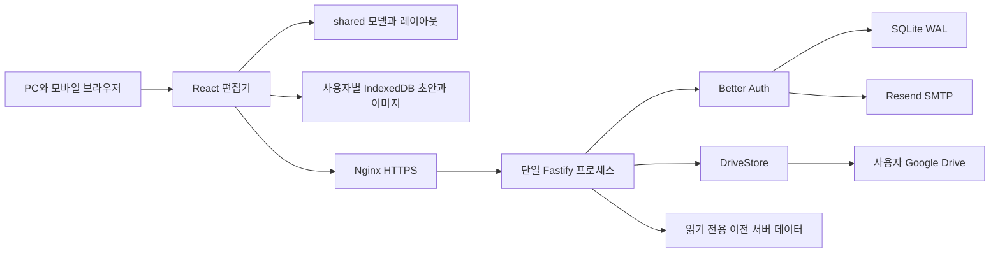

# 구조와 데이터 흐름

현재 상태는 [CURRENT_STATUS](CURRENT_STATUS.md), 필드와 HTTP 계약은 [DATA_API](DATA_API.md), 설계 이유는 [DECISIONS](DECISIONS.md)를 읽는다.

## 구성

Vite는 개발 중 UI와 API 프록시를 제공한다. 운영에서는 Fastify가 `dist/client`와 API를 함께 제공하고 Nginx가 HTTPS를 종료한다. 새 Drive 본문/이미지는 요청 중 메모리로만 처리한다. SQLite는 계정/연결/메타데이터/작업 기록을 보관한다.

## 모듈 책임

| 소스 | 책임 |
|---|---|
| [shared/model.ts](../shared/model.ts) | Zod 모델, 트리 검증, 노드 생성/삭제/복사/검색, 제한 |
| [shared/movement.ts](../shared/movement.ts) | 선택 루트, 순서/부모/방향/계층/좌표 변경 |
| [shared/layout.ts](../shared/layout.ts) | 접힘과 자유 offset을 포함한 배치 계산; UI 독립 |
| [shared/freemind.ts](../shared/freemind.ts) | 안전한 XML 파싱, `.mm` 왕복, 미지원 확장 보존 |
| [shared/revision.ts](../shared/revision.ts) | 이전 Drive 리비전 형식 식별 |
| [src/App.tsx](../src/App.tsx) | 세션 경계, 문서 목록/선택/생성/이전, 언어·인증 UI |
| [src/Editor.tsx](../src/Editor.tsx) | 편집 명령, 단축키, undo/redo, 속성, 검색, 복구 안내 |
| [src/Canvas.tsx](../src/Canvas.tsx) | HTML 노드+SVG 연결, 드래그/선택/터치/뷰포트 |
| [src/persistence.ts](../src/persistence.ts) | 초안 복구, 자동 저장, 조회 경합 차단, 충돌 처리 |
| [src/local-store.ts](../src/local-store.ts) | IndexedDB 문서·이미지·캐시, 이미지 로컬화, Drive 생성 |
| [src/ManagedImage.tsx](../src/ManagedImage.tsx) | 인증/로컬 이미지 표시 |
| [src/export.ts](../src/export.ts), [src/text.ts](../src/text.ts) | 이미지·HTML·ZIP 출력 및 텍스트 처리 |
| [src/api.ts](../src/api.ts), [src/drive.ts](../src/drive.ts) | 세션 API, 오류 래퍼, 지연 로드 Picker |
| [server/app.ts](../server/app.ts) | 앱 팩토리, 인증·SMTP·DB 초기화, 보안 헤더·rate limit·정적 파일 |
| [server/index.ts](../server/index.ts) | 환경 로드, listen, SIGINT/SIGTERM 종료 |
| [server/storage.ts](../server/storage.ts) | 소유자 인증·변경 직렬화, Drive/legacy 라우팅, 이전 검증 |
| [server/drive-auth.ts](../server/drive-auth.ts) | state/PKCE, 토큰 암호화·갱신, Google 계정 연결 |
| [server/drive-client.ts](../server/drive-client.ts) | 고정 Google endpoint, 제한 다운로드, 오류 분류, 조건부 갱신 실험 |
| [server/drive-store.ts](../server/drive-store.ts) | 파일/이미지/리비전/중복 방지/보호 복사/휴지통 |

## 편집과 동기화

Editor가 구조를 복제해 편집하고 `validateMap`을 통과시키면 `change`가 화면과 초안을 갱신한다. undo/redo는 메모리에 최대 100단계로 유지하며, 파일/복구 데이터에 undo 이력 전체를 저장하지 않는다. 실제 원격 문서 교체(`remoteEpoch`) 시 선택과 undo/redo를 초기화한다.

`usePersistence`의 핵심 상태:

| 값 | 의미와 주의 |
|---|---|
| `record` | 현재 화면의 최신 작업; 보호 복사 저장 시 ID가 바뀔 수 있음 |
| `seq` / `saved` | 로컬 편집 순번/서버가 확인한 순번. 같을 때만 저장 완료 |
| `pending` | 진행 중/재시도 요청의 snapshot·seq·UUID. 메모리 상태이며 새로고침 지속은 현재 보장하지 않음 |
| `busy` | 저장/최신본 열기 중 겹치는 작업 차단 |
| `epoch` / `check` | 저장 또는 더 최신 조회 이전에 시작한 응답을 식별하여 폐기 |
| `conflict` / `blocked` | 자동 덮어쓰기 중단 / 로그인·권한·용량 등 사용자 조치 필요 |
| `writes` | IndexedDB 쓰기 순서 유지; 저장 응답이 최신 입력을 덮지 않게 UI 반영은 await 이전 |

로컬 변경 → IndexedDB 초안 기록 → 입력 중단 2초/연속 편집 15초 후 flush → 로컬 이미지 업로드 → 동일 requestId로 PUT → 성공한 리비전/ID 반영 순서다. 저장 중 추가 편집은 문서 내용을 유지하면서 응답의 ID/리비전과 변경하지 않은 이미지 참조만 반영한다. 실패한 일반 통신은 상한 60초의 지수 백오프로 재시도한다.

외부 확인은 진입, focus/online/visibility 복귀, 활성 상태 30초 간격이다. 진행 중인 저장/불확실한 pending보다 외부 조회를 먼저 적용하지 않는다. 조회 시작 이후 저장이 있었거나 다른 조회가 앞섰다면 응답을 버린다. 진짜 리비전 차이와 로컬 변경이 겹칠 때만 충돌로 중단한다.

`recover`가 선택한 dirty 초안에는 브라우저 전용 `recoveredDraft` 표시를 붙여 첫 렌더부터 미저장으로 취급한다. 비동기 IndexedDB 조회 뒤에 dirty를 알아차리는 초기화는 원격 원본으로 되돌아가는 버그를 만들므로 재도입하지 않는다. 이미 현재 탭이 정리한 초안보다 오래된 다른 탭 초안을 자동으로 되살리지 않는다.

최신본 열기는 현재 문서와 이미지를 독립적인 로컬 복구본으로 먼저 보관한다. 준비 중 추가 입력이 생기면 교체를 중단한다. 충돌 복사본 저장은 새 Drive 문서를 만들고 그 문서로 전환한다.

## 서버 저장과 인증 경계

변경 요청은 로그인 사용자별 Promise 체인으로 직렬화한다. 이는 이 Node 프로세스 안의 순서 보장이고, FreeMind/다른 서버 프로세스의 동시 수정을 잠그지 않는다.

Drive 문서는 stat → 제한된 bytes → stat으로 읽고 체크섬과 문서 리비전이 일관된지 검사한다. md5Checksum은 편집 변경 감지용이며 인증 수단이 아니다. 권한은 별도로 로그인 계정·연결된 Google 계정·파일 소유권·첨부 연결을 검사한다. 체크섬 없는 파일은 보수적으로 이전 버전/ETag 비교로 처리한다.

조건부 갱신은 연결 시 실험 파일에서 오래된 If-Match가 거절되고 내용이 보존된 것을 확인한 경우만 허용한다. 그 외에는 원본 대신 새 변경본을 생성한다. 생성/저장 응답 유실은 요청 ID와 요청/저장 바이트 해시를 확인해 재시도한다. 캐시 삭제가 작업 기록 삭제를 의미하지 않는다.

Google 로그인은 Better Auth, Drive 권한 동의는 별도 OAuth 흐름이다. 같은 이메일이라는 이유만으로 계정을 자동 연결하지 않는다. Drive state는 사용자·세션에 연결된 10분 유효 일회용 값이고 PKCE를 사용한다. refresh는 계정별 직렬화와 DB의 기존 토큰 비교 갱신을 사용한다. 연결 해제는 자격 증명·목록 캐시를 제거하며 Drive 파일은 지우지 않는다.

## 변경할 때 함께 볼 경로

- 모델 변경: model → freemind → layout/movement → Editor/Canvas → 기존 fixture/왕복/이전 검사.
- 저장 변경: persistence/local-store → storage/drive-store/client → fake-drive → sync/cloud E2E → 원본 보호와 오프라인 이전 형식.
- 인증 변경: app/drive-auth → api/drive/App → Google/SMTP 설정 → 소유자 차단·계정 분리 검사.
- 운영 변경: SERVER → deploy 설정 → 환경 예시 → production/backup 검사 → 실제 상태/롤백.
